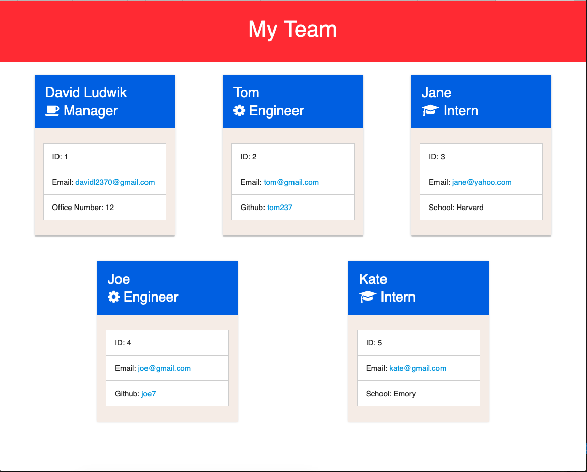

# hw-10

Team Page:
This program utilizes the terminal to create an html webpage that display's key data about each one of your team members. To use this application, first navigate to the application's main folder in your terminal. Now run the command:

```
npm i
```
This installs all relevant node_modules for the program. To run program, run:
```
node index.js
```
First you will be prompted to enter manager info, then you can add as many interns/engineers as necessary. When finished is selected, the html is generated and saved as a team.html file.

Screenshots:



Created by David Ludwik

The program uses and OOP approach where Managers, Engineers, and Interns are all instantiations of classes that extend a base employee class. The team is stored as objects in an array. The team is created by the addMember function that is called initially on page load. This functions attains employee details with the inquire module and uses that data to create a new employee object. After the employee is added the array, the function will call itself recursively until the user is finished.

Once the team is finished, the generateHTML function adds the html boilerplate to a string. Then the team array is looped through and the card html is added for each team member. The text is then written to a team.html file via the fs module.

Tests of each employee class have also been written. These can be activated in terminal with the following command:
```
npm test
```